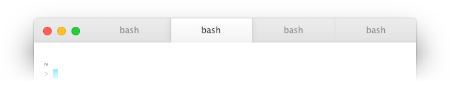

hyperterm-mactabs
========================

Tab style enhancements for [Hyper.app] inspired by macOS, featuring subtle gradients, drop shadows, and the Lucida Grande typeface. Tab close buttons have been moved to the left side for consistency with other Mac programs. This plugin is intended to be compatible with other themes and will attempt to override any tab styles implemented by other plugins. It has only been tested on macOS and cannot be guaranteed to work on other platforms.

How to use
----------

Add `hyperterm-mactabs` to `plugins` in `~/.hyper.js`. Hyper.app should automatically load the plugin. If it does not, perform a "Full Reload" for the change to take effect.

[Hyper.app]: https://hyper.is/
